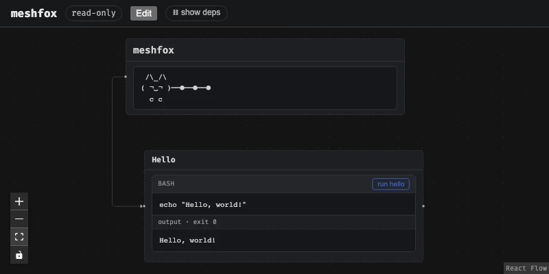
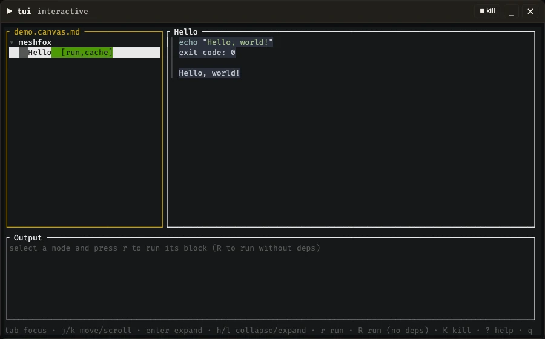

<!-- meshfox:canvas -->
# meshfox

```
 /\_/\
( ¬‿¬ )──●──●──●
  c c
```

[Website](https://meshfox.orofarne.net/) · [GitHub](https://github.com/orofarne/meshfox) · [Download binary](https://github.com/orofarne/meshfox/releases)

Install on Linux/macOS in one line:

```sh
curl -fsSL https://raw.githubusercontent.com/orofarne/meshfox/main/scripts/install.sh | sh
```

<!-- meshfox:var name="INSTALL_PATH" prompt="Install prefix?" default="/usr/local/bin" -->

Or build and install from source yourself — this button is a `` ```button `` fence (see SPEC.md's "Button fences"): no code of its own, just a shortcut to "Install" under Development below, runnable from anywhere via `meshfox run install-from-source` too.

```button name="install-from-source" deps="install/install"
🔨 Install from source
```

An interactive canvas: a hierarchical, node-based document where nodes hold Markdown, and code blocks inside that Markdown can be run.

Meshfox pulls together several documentation patterns that are usually spread across separate tools into one file format: the mindmap-style canvas of Miro and Obsidian, Livebook’s lightweight markdown-compatible storage, code-in-document execution from Jupyter Notebook and Livebook, and Make’s dependency graph for running scripts. A built-in Starlark constraint system (meshfox check) lets a canvas enforce its own consistency rules, and a canvas can be exported to a static HTML site or a PDF (both experimental — see Usage below).

Status: **early bootstrap**.

This document is itself a valid meshfox canvas — every `##` section here is a node, nested under this root. See [SPEC.md](./SPEC.md) for more details.

## Concept
<!-- meshfox:node id="concept" -->

- A project is one **canvas**: a tree of nodes starting from a single **root** node.
- From the root, large **section** nodes branch off (e.g. one section per feature).
- From sections, further **block** nodes branch off. Blocks hold Markdown.
- A canvas is stored as a single, plain `.md` file — node metadata (ids, positions, edges) lives in HTML comments, so the file still renders sensibly in GitHub or any plain Markdown viewer, and diffs cleanly in git.
- Markdown inside a block can contain fenced code. A fence can be marked *runnable*; running it executes the code and (optionally) writes the result back into the same node, right under the code, so nobody has to re-run it just to see what happened last time.
- A runnable fence can declare `deps=` on other blocks — running it runs its whole dependency chain first, `make`-style, with nothing run twice. Blocks can also share document-scoped config values (declared once as `meshfox:var`), each block opting in individually via its own `env=` attribute — so running one block never prompts for a variable only some *other* block needs. A `` ```button `` fence is the same `deps=`/`name=`/`default=` machinery with no real code of its own — a prominent shortcut button, captioned by its own body (and, via `name=`/`default=`, a short CLI alias) for a chain that lives elsewhere in the document — see SPEC.md's "Button fences".
- Three ways to interact with the same files:
  - a browser UI (canvas view + block runner) backed by a small Rust server — opens read-only, so pulling up a canvas to look around never one-click-modifies it: running a block is always allowed (you're still explicitly clicking "run", and it's the whole point of a canvas), but a `cache`d block's output isn't written back to the file until an explicit "Edit" button is clicked, which also unlocks dragging, resizing, and saving layout. Output streams into the browser live as the block runs (not just once it's finished), and a running block gets a Kill button, for when one hangs.
  - a CLI that runs blocks non-interactively, `make`-style, for use in scripts/CI — `meshfox list` prints every runnable block as a tree, so there's no need to go spelunking through the file to find out what's runnable. `meshfox run` streams output live too (the same async, killable executor as the browser UI); Ctrl+C kills whichever step is currently running, whole process group and all, and stops there — whatever earlier steps in the chain already completed stays cached.
  - a terminal UI (`meshfox tui`, experimental) — the browser's tree-and-block-runner experience without leaving the terminal: browse the node tree, read a node's rendered body (syntax-highlighted code, images), and run blocks with the same live streaming/kill/cache behavior as the other two. See "Terminal viewer" under Usage below.
- Beyond editing and running: a built-in Starlark constraint system (`meshfox check`) lets a canvas validate its own consistency, and a canvas can be exported to a static HTML site or a PDF (both experimental — see Usage below).

## File format
<!-- meshfox:node id="file-format" type="include" -->

[SPEC.md](./SPEC.md)

## Markdown extensions
<!-- meshfox:node id="markdown-extensions-doc" type="include" -->

[MARKDOWN.md](./MARKDOWN.md)

## Auto-layout
<!-- meshfox:node id="auto-layout" -->

Nobody has to type `x`/`y`/`w`/`h` by hand. The web UI lays out anything still unpositioned live, in the browser.

`GET /api/canvas` sends exactly what's in the file — no computed suggestion, no `suggestedX`/etc. over the wire. `web/src/autolayout.ts` fills in a box client-side for anything still missing a real position: sections (root and its direct children) read top-to-bottom with just a small nudge to the right, same as a document's title followed by its headings — not yet a real indent. From there down it's a classic indented tree view, the same shape as a file tree or a collapsed outline: each section's own content steps fully to the right of its parent, siblings at a given depth stack vertically without overlapping, and further nesting keeps stepping right from there, with a `group`'s box always the bounding box of its resolved members. Width is tier-based: root and its direct children share one width, `60%` of the viewport; everything deeper gets `55%`, uniformly regardless of how much deeper. Viewport width is read once, when the canvas loads — it doesn't recompute on window resize. Height is never estimated: it comes from React Flow's own measurement of each node's actual rendered content, live — the layout self-corrects as soon as a real measurement lands (and again later, e.g. as a running block's output grows). A depth-≥2 node additionally gets a `max-height` cap so one long block can't drag a whole subtree far from its parent; past the cap it scrolls internally (`.mesh-node-body`'s existing `overflow: auto`) instead of growing the box further. None of this is ever written to the file just from loading it — a node only gets its box persisted once it's actually been dragged/resized (see `touchedNodeIds` in `App.tsx`).

Edit mode's toolbar has an **Auto-layout** button that clears every non-group node's stored `x`/`y`/`w`/`h` in the file outright (`POST /api/canvas/clear-layout`), reverting the whole document to auto-placed — behind a confirmation dialog, since it can't be undone from the UI. Useful for backing out of a bunch of hand-placed positions and letting the client lay everything out fresh.

Edit mode's toolbar also has an **⚙ options** button, next to Auto-layout: it toggles `meshfox:option` declarations — `unfold` (flips whether the canvas opens with every subtree expanded or folded to a compact outline by default) and `auto-timestamps` (opts the document in to automatic `createdAt`/`updatedAt` stamping, off by default — see SPEC.md's "Timestamps") — via `PUT /api/options`, writing the same comment hand-editing would. See SPEC.md's "Options".

## Variables
<!-- meshfox:node id="variables" -->

Document-scoped config values a canvas wants from whoever runs it — declared once as `<!-- meshfox:var ... -->` comments in the root node (this document declares exactly one, `INSTALL_PATH`, right above "Concept" — invisible here since it's an HTML comment, same as every other bit of meshfox bookkeeping). Declaring one doesn't put it in any block's environment by itself, though — a block has to opt in with its own `env=` fence attribute to actually reference it (`env="$INSTALL_PATH"`, see "Install" below), and only blocks that do ever resolve or prompt for anything: running any *other* block in this file never asks about `INSTALL_PATH`, however many blocks elsewhere might use it. Asked for interactively the first time some block's `env=` actually needs it, then remembered in a local `.meshfox/<filename>.env` cache (`.gitignore`d, analogous to CMake's `CMakeCache.txt`) so it's not asked for again by any block referencing it afterward. `meshfox configure` walks every declared variable up front regardless of `env=` usage; `meshfox run --set NAME=value` supplies one non-interactively (e.g. for CI); the web UI shows a small form in place of a prompt, scoped to just the clicked block's own chain, only for whatever isn't already resolved. See SPEC.md's "Variables" for the full writeup, including `secret` (never cached, always re-asked) and the `int`/`bool`/`select` types.

## Constraints
<!-- meshfox:node id="constraints" -->

A ` ```starlark constraint ` fence is a sandboxed Starlark contract living right in a node's own Markdown body — a way to assert invariants a canvas should hold (e.g. "every node tagged `table` has exactly one `file` child"), checked by `meshfox check` rather than only by convention. See SPEC.md's "Constraint fences" (included above, under "File format") for the full reference. The worked example below actually runs — `meshfox check examples/constraints.canvas.md` from the repo root — and includes the newest piece: a constraint reading a `file`-type node's own already-declared target (`.content()`/`.json()`/`.yaml()`/`.toml()`/`.csv()`), the same mechanism `LICENSE.canvas.md` below uses for real, to keep this project's own dependency tables honest.

### Worked example
<!-- meshfox:node id="constraints-example" type="include" -->

[examples/constraints.canvas.md](./examples/constraints.canvas.md)

## How-to
<!-- meshfox:node id="how-to" -->

A few common recipes, each pointing at a real, running example elsewhere in
this repo rather than repeating it.

### Structured docs instead of a Makefile
<!-- meshfox:node id="structured-docs-instead-of-a-makefile" -->

This very README is the worked example: every `##` section is a node (see
"Concept" above), and its runnable fences — "Usage" below runs real CLI
invocations, "Development" runs the real build/test/lint commands — replace
what would otherwise be a Makefile's targets. `meshfox validate`/`meshfox
check` double as the pre-commit/CI gate ("Full check" under "Development"),
and `meshfox list` prints every runnable block as a tree instead of grepping
the file for what's runnable.

### A canvas's own Python environment
<!-- meshfox:node id="a-canvas-s-own-python-environment" -->

[examples/python-venv.canvas.md](./examples/python-venv.canvas.md) — a
project-local `.venv/`, created once and reported as a computed
`meshfox:var` (`PYTHON`) every other Python fence references via
`interpreter="$PYTHON -u"`, so nothing hardcodes a path or depends on
whatever Python happens to be on `$PATH`. Its "Requirements" node also
demonstrates a smaller trick: a plain requirements list, installed directly
via `interpreter="$PYTHON -m pip install -r"` — no separate
`requirements.txt` to keep in sync, since `interpreter=` hands pip a real
temp file built from the fence's own body.

### Running a block under a different language/tool
<!-- meshfox:node id="running-a-block-under-a-different-language-tool" -->

[examples/interpreters.canvas.md](./examples/interpreters.canvas.md) — every
shape of `interpreter=` side by side: a bare command (`python3`), one with
its own flags (`python3 -u`), any other tool on `$PATH` (`node`), an
interactive `tty` block handing over a real REPL, and the same mechanism on
a `file`-type node instead of a fence.

### Checking that documentation stays consistent
<!-- meshfox:node id="checking-that-documentation-stays-consistent" -->

[LICENSE.canvas.md](./LICENSE.canvas.md) below is the real, load-bearing
example: its `every-direct-dep-is-documented` constraint fails `meshfox
check` whenever a `Cargo.toml`/`package.json` dependency has crept in with no
matching row in that file's license tables — the same mechanism
"Constraints" above walks through in isolation
([examples/constraints.canvas.md](./examples/constraints.canvas.md)'s
"Dependency audit" node).

### Publishing a canvas as a static site
<!-- meshfox:node id="publishing-a-canvas-as-a-static-site" -->

See "Usage" below → "Static export" for the real `meshfox static`
invocation against [examples/hello.canvas.md](./examples/hello.canvas.md)
and [site-template/](./site-template/). This README's own repo builds and
publishes itself that way (`scripts/build-site.sh`, see `.gitignore`'s
`/site-dist` entry) — the live result is
[meshfox.orofarne.net](https://meshfox.orofarne.net/).

### A second brain for an LLM agent
<!-- meshfox:node id="a-second-brain-for-an-llm-agent" -->

[examples/second-brain.canvas.md](./examples/second-brain.canvas.md) — one
memory per node, tagged by type (`user`/`feedback`/`project`/`reference`),
with a constraint fence enforcing that a `feedback`/`project` memory always
carries a `**Why:**` line so a later session can judge an edge case instead
of blindly following the rule. The same schema this repo's own coding-agent
sessions use for their persistent memory, outside the chat window itself.

## Usage
<!-- meshfox:node id="usage" -->

A few commands, run for real against the installed `meshfox` binary (see "Development" below for building/installing it). The output below is cached from actually invoking it (see "Cached output" above) rather than typed by hand, so it can't quietly drift from what the CLI does — and it doubles as an end-to-end check of the runnable-block feature itself: this section's own blocks are ordinary `name=`/`cache` fences, executed the same way any project's would be.

### CLI help
<!-- meshfox:node id="usage-help" -->

Run `meshfox spec` to print the full format specification (`SPEC.md`,
embedded in the binary at compile time) — not cached here since dumping it
verbatim into this section would nest the whole `.canvas.md` grammar inside
an example of the format it's describing.

```bash name="usage-help" cache
meshfox -h
```
<!-- meshfox:output name="usage-help" hash="d456ec0a" -->
````text
exit code: 0 · 20ms


 /\_/\
( ¬‿¬ )──●──●──●
  c c


CLI and local web viewer/editor for a meshfox canvas. Run `meshfox spec` for the full .canvas.md format specification.

Usage: meshfox [OPTIONS] [COMMAND]

Commands:
  run            Run one or more named code blocks
  configure      Interactively resolve every declared `meshfox:var` (see SPEC.md's "Variables") and save the answers to the on-disk cache (`.meshfox/<filename>.env`, next to the canvas file) so `run` doesn't have to ask again. Shows each variable's currently-resolved value as the prompt's own default — press Enter to keep it. Secret variables are never cached, so there's nothing for this to save for them; they're skipped here and asked for fresh at run time instead. Requires an interactive terminal
  create         Create a new, empty canvas file: just the `meshfox:canvas` marker followed by a lone root heading (`#`) named after the file itself (its name with a trailing `.canvas.md`/`.md` stripped). Fails if the file already exists — this never overwrites
  view           Start the local web UI: canvas view, run buttons. Opens read-only — running a block is always allowed, but click "Edit" in the browser to unlock dragging, resizing, saving layout, and persisting a `cache`d block's output back into the file
  tui            Experimental: an ncurses-style terminal viewer — browse the node tree, read a node's rendered Markdown body (syntax-highlighted code, local images shown inline where the terminal supports it), and run blocks with live streamed output, right in the terminal. Same deps-chain/cache/`meshfox:var` handling as `meshfox run`/`meshfox view`. A `tty` block hands the real terminal over to it, same as `meshfox run`'s own `tty` handling. The tree/document panes' own mouse support covers clicking a tree row to select it (or its ▾/▸ marker to expand/collapse) and scrolling either pane; each row's title is also colored to match the node's own `color=`. `e` opens a fullscreen raw-source editor (vim-style modal input via `edtui`, meshfox-specific syntax highlighting, full mouse support — click to position the cursor, drag to select, scroll to move the viewport) on the selected node's own file — the terminal counterpart to the browser UI's Source mode. `Ctrl-f` switches between the document and any `include`d file; `Ctrl-n` turns the heading under the cursor into a node in one keystroke; `Ctrl-p` suggests attributes for the current `meshfox:node`/`meshfox:edge` comment or runnable-fence line, or, with the cursor inside a `tags=` value, tags already used elsewhere in the document. Still no *structural* editing beyond that (use `meshfox node ...` or the browser UI's Edit mode for that)
  mcp            Experimental: an MCP stdio server giving an AI agent tool-call access to every canvas file under the current directory, without shelling out to this same binary. Takes no arguments — a host launches it the same way as any other stdio MCP server: `{"command": "meshfox", "args": ["mcp"]}`, and whichever directory it's started in becomes its root. Multi-canvas by design, but keeps "one file, one process" isolation underneath: `canvas_open`/`canvas_close`/`canvas_list` manage a registry of canvases, each backed by its own spawned, isolated child process (a crash or hung debug session on one canvas can't affect another) — resolved only under that root directory, never above it. Every other tool requires that `canvas_id` as its first argument, mirroring its single-canvas equivalent exactly: a stateful debug session (`debug_start`/`debug_send`/`debug_stop` — a persistent `bash` kept alive in a node/block's own resolved cwd/env, so a multi-step snippet's state — exported vars, files it wrote — survives between calls, unlike a one-shot `meshfox run`) and thin wrappers around the whole `node <op>` surface — every subcommand, not just a subset: `show`/`find` (find as structured JSON, CSS-selector matching, same as `node find`) and the mutating `add`/`meta`/`body`/`block`/`rm`/`mv`/`rename`/`set_id`/`edges`/ `move`/`reorder`. Deliberately does *not* attempt batch/ transactional multi-edit or optimistic-concurrency write conflicts (see TODO.canvas.md's own "MCP-редактирование файла"/"Оптимистичная конкурентность" — still open design questions, not implemented here) — every write here is the same immediate read-modify-write `node <op>` already does
  validate       Validate that a file parses as a meshfox canvas — same checks `run`/`view` already do before touching anything (single root, no duplicate ids, no dangling `meshfox:edge` targets, `group`/ `file`/`link` body rules) — without executing anything or writing the file back. Exits non-zero on a parse error, so it's usable as a pre-commit/CI check
  check          Run every embedded ` ```starlark constraint ` fence's Starlark contract against the document (see `crate::constraint`/SPEC.md's "Constraint nodes") and report which passed. Distinct from `validate`: `validate` checks that the file *parses* as a well-formed canvas; `check` asks whether the document as a whole satisfies whatever rules its own constraint fences declare (e.g. "every node tagged `table` has exactly one `file` child") — implies `validate` first, since an unparseable file has no constraints to run. Resolves includes first (same as `validate`/`view`/`static`), so a constraint sees the fully composed document — including one that lives inside an included canvas, evaluated against its namespaced `{include_id}/{original_id}` — same tree the web UI checks, not just this file in isolation. Exits non-zero if the file (or any include target) fails to parse, an include is broken, or any constraint fails, so it's usable as a pre-commit/CI check alongside (or instead of) `validate`
  list           Print every runnable code block in the canvas as an indented tree, each with a ready-to-paste `meshfox run <path...> <name>` — so you don't have to go spelunking through the file to find out what's runnable. Same raw-file-only scope as `run`/`validate` (no include resolution)
  static         Experimental: export a canvas as a static site. Resolves includes (same as `validate`/`view`), turns the canvas's node tree into a recursive `SiteData` (context key `site`) and hands it to a user-supplied Tera template. A node with no real, authored `x`/`y`/`width`/`height` gets no computed position at all — the template renders it as an ordinary nested HTML element and the *browser* lays it out and sizes it from its real content (no pre-computed/estimated pixels to get wrong); a node that does have all four real values keeps rendering at exactly that authored pixel position. A structural (parent/child) connector between two flow-positioned nodes is drawn in pure CSS (they're always DOM-adjacent); everything else — a `meshfox:edge` cross-reference, or a structural edge touching a real-positioned node — is left for a small non-interactive JS pass in the template to measure and draw. Every `*.tera` file in `--template` (except one whose basename starts with `_`, a partial meant to be ``ed rather than rendered standalone) is rendered and written to `--out` at the same relative path minus `.tera`; every other file is copied verbatim (CSS, fonts, ...) — except `template.toml` itself, the template's own config file (optional; a template with none gets an empty `base_url` and no `icons`), read from `--template`'s own directory and never copied to `--out`. A local image referenced from a node's Markdown body is copied alongside the output automatically; a `file`-type node's `display="code"` target is read once and inlined into the HTML directly (nothing left to fetch once static). See `site-template/` in this repo for a working example, including its own `template.toml`
  pdf            Experimental: export a canvas as a PDF, via a real (headless) Chrome/Chromium — a system install is used if one can be found (`CHROME` env var, common binary names on `PATH`, well-known install locations); otherwise a pinned Chromium build is downloaded once and cached for next time. Two kinds of pages, both by default: a canvas page — every node at its own box, full body always shown (never folded, regardless of the document's own fold settings); a real authored `x`/`y`/`width` is kept exactly, everything else auto-laid-out the same way the live web UI would place it, but height always auto-sizes to the node's own real content, authored or not, so nothing is ever clipped — printed at true 1:1 CSS-px scale on its own custom-sized page rather than scaled to fit a fixed paper size, with connectors for both structural parent/child and `meshfox:edge` cross-references; then the full node tree in flow/document order (headings by depth, tags, body, target, standard A4 pagination)
  node           Structural edits to individual nodes in a canvas file: add, move, rename, delete, or set a node's body/position/style/edges — the CLI counterpart to the web UI's Edit-mode node operations (the same `mdcanvas` surgical patches `meshfox view`'s `/api/nodes*` routes use), for scripting/CI or whenever a hand-rewrite would risk getting heading depth, sibling order, or dangling-edge cleanup wrong. Every subcommand validates the fully-patched document still parses before writing it back, same as every other mutating command here
  spec           Print the full .canvas.md format specification (SPEC.md, embedded in this binary at compile time) — the canonical reference for the format, available offline wherever `meshfox` is installed
  check-updates  Check github.com/orofarne/meshfox's releases for a newer version than this binary and, if one exists, offer to download and install it in place (replacing the running executable). A no-op if this build wasn't made from a release tag (e.g. a local/dev build) — there's no version to compare against a release with, so it just says so and exits
  completions    Print a shell completion script to stdout. Source it directly or write it to the completions directory your shell scans on startup, e.g. `meshfox completions zsh > ~/.zfunc/_meshfox` (with `~/.zfunc` on `fpath`), or `meshfox completions bash > /etc/bash_completion.d/meshfox`
  help           Print this message or the help of the given subcommand(s)

Options:
      --agent-help  Print usage guidance for AI coding agents (when to prefer `node` subcommands over hand-editing, non-interactive `run`, etc.) and exit
  -h, --help        Print help
  -V, --version     Print version

Website: https://meshfox.orofarne.net/

Agent Usage:
  If you are an AI coding agent, run `meshfox --agent-help` before hand-editing a
  .canvas.md file. It covers when to prefer `meshfox node <verb>` over a raw text
  edit, how to run non-interactively, and other guidance not covered above.
````
<!-- /meshfox:output -->

#### Node commands
<!-- meshfox:node id="usage-node" updatedAt="2026-08-29T07:32:30.452469Z" -->
`meshfox node <op>` exposes the same per-node surgical patches
(`insert_child_node`, `delete_node`, `reparent_node`, `set_node_title`,
`set_node_body`, `set_node_meta`, `set_node_edges`, `reorder_by_position` —
all in `mdcanvas`) that back the web UI's Edit-mode operations over its
`/api/nodes*` routes — so a structural change (adding a child at the right
heading depth, moving a subtree without breaking its nesting, deleting a
node without leaving a dangling `meshfox:edge` behind) can be scripted or
run in CI without going through the browser, and without hand-rewriting
Markdown heading levels yourself. Every subcommand takes an optional
`--canvas <path>` (auto-discovered like `validate`/`list` when omitted)
and validates the whole patched document still parses before writing it
back — the same validate-before-commit shape every mutating server
handler already uses. As with any other write in this file, running
`meshfox validate` afterwards is still worth doing: parsing is validated
here, but a deletion or a rename can still leave a `deps=`/`env=`
reference elsewhere dangling, which is `validate`'s job to catch, not
`node`'s.

- `add <parent-id> <title>` — insert an empty child node, last in the parent's subtree; prints the new (slugged) id
- `rm <node-id> [--keep-children]` — delete a node and its subtree, or (with the flag) just the node, promoting its direct children to its former parent
- `mv <node-id> <new-parent-id>` — move a node under a new structural parent in one step (the web UI needs two: link, then promote)
- `rename <node-id> <title>` — change heading text only; id, heading level, and body untouched
- `body <node-id> [--file <path>]` — replace a node's whole body, from a file or stdin
- `append <node-id> [--file <path>]` — append to a node's existing body, from a file or stdin, without reading the current body back first just to resend it unchanged; bumps `updatedAt=` the same way `body` does (see SPEC.md's "Timestamps")
- `meta <node-id> [--x --y --w --h --color --type --display --lang --interpreter --fold --created-at]` — set position/size/style; an omitted flag keeps the node's current value; `--w`/`--h` on a `group` are rejected (its box is always derived from its members), but `--x`/`--y` are accepted — a group's own position is a real anchor its members' own `x`/`y` are relative to (see SPEC.md); `--fold true`/`--fold false` sets a per-node fold override, `--fold default` clears it back to following the document's own default (see SPEC.md's "Options" section); `--created-at` overrides `createdAt=` (RFC3339), mainly for backfilling/importing existing data — meshfox stamps a fresh one automatically on `add` (see SPEC.md's "Timestamps")
- `edges <node-id> [--from <id>]... [--clear]` — replace a node's extra (`meshfox:edge`) parents
- `reorder` — resync sibling heading order in the file to match current x/y, the same resync the server runs on every UI save
- `show <node-id>` — print a node's parent/children/extra-parents/type/position/created/updated (read-only)

```bash name="usage-node" cache
meshfox node -h
```
<!-- meshfox:output name="usage-node" hash="dba20bec" -->
```text
exit code: 0 · 22ms

Structural edits to individual nodes in a canvas file: add, move, rename, delete, or set a node's body/position/style/edges — the CLI counterpart to the web UI's Edit-mode node operations (the same `mdcanvas` surgical patches `meshfox view`'s `/api/nodes*` routes use), for scripting/CI or whenever a hand-rewrite would risk getting heading depth, sibling order, or dangling-edge cleanup wrong. Every subcommand validates the fully-patched document still parses before writing it back, same as every other mutating command here

Usage: meshfox node <COMMAND>

Commands:
  add      Add a new child node under `parent-id`, as the last item in its existing subtree (`mdcanvas::insert_child_node`) — same as the web UI's "add child" button. Empty-bodied and unpositioned by default, same as before `--body-file`/the position/style flags below existed — either can still be set later with `node body`/`node meta` instead, if not given here. Prints the new node's id: a slug of `title`, de-duplicated against every id already in the file
  rm       Delete a node. By default the whole subtree goes with it (`mdcanvas::delete_node`), and any `meshfox:edge from="..."` elsewhere that pointed into the deleted subtree is dropped too, so the file can't be left with a dangling reference. `--keep-children` instead deletes just this node, promoting its direct children (and everything under them, untouched otherwise) to its own former parent (`mdcanvas::delete_node_reparent_children`). Refuses to delete the root either way
  mv       Move a node to a new structural parent (`mdcanvas::reparent_node`). That core function only ever promotes an *existing* extra-parent edge to structural parent — the web UI's two-step dance (drag a new edge onto the node, then promote it) — so this adds the `meshfox:edge from="new-parent-id"` line itself first, making the move a single atomic step from the CLI. Refuses to move the root, or to move a node into itself or one of its own descendants (would make the tree cyclic)
  rename   Rename a node's heading text, leaving its id, heading level, and body untouched (`mdcanvas::set_node_title`) — a node's id is pinned the first time it's written and never follows later title edits
  set-id   Change a node's id (`mdcanvas::rename_node_id`) — the stable handle used for CLI/API addressing, `meshfox:edge from=`/`parent=` references, and `deps="node-id/block"` fence references. Rewrites every reference to the old id it can find: other nodes' `parent=` and `meshfox:edge from=` attributes are updated exactly (they're structurally tracked by the parser), and `deps=` references are updated best-effort (plain text, not parser-validated — run `meshfox validate` afterward to catch anything this missed, e.g. a reference that was already stale). Fails if `new-id` is empty, contains a `"` character, or is already used by another node
  body     Replace a node's whole Markdown body (`mdcanvas::set_node_body`) — what the web UI's in-node editor would send, if it had one yet (see README's roadmap; for now the UI can reposition and run, not edit text). For a `file`/`link` node the body is its one Markdown link (`[title](target)`); a `group` node's body must stay empty. Reads the new body from `--file`, or from stdin if `--file` is omitted
  append   Appends to the end of a node's existing Markdown body (`mdcanvas::append_node_body`) — after whatever's already there, still before its first child's own heading — without having to first read the current body back just to hand it to `node body` unchanged. Reads the text to append from `--file`, or from stdin if omitted, same convention as `node body`. Bumps `updatedAt=` the same way `node body` does (see SPEC.md's "Timestamps"), since it's implemented on top of the same `set_node_body`
  block    Rewrites just one runnable fence's own info-string attributes (and, optionally, its code — `--code-file`/`--code -`) inside a node (`mdcanvas::set_fence_attrs`) — every other fence in the node, the rest of its body, and the rest of the document are left byte-for- byte untouched. Unlike `node body`, never needs the whole node body reconstructed just to flip one flag on one block. `block-name` is resolved the same way `meshfox run`/`meshfox list` already do (explicit `name=`, the sole unnamed fence, or an explicit `default` flag) — see SPEC.md's "Runnable code fences". Any field left entirely unset keeps its current value; a paired `--no-`/`--clear-` flag explicitly removes it instead. `--deps` is validated (existing targets, no cycle) against the whole document right away, not deferred to a separate `meshfox validate`
  meta     Set a node's position/size/style fields (`mdcanvas::set_node_meta`) — `--x`/`--y`/`--w`/`--h` for a manual position/size override, `--color`/`--type`/`--display`/`--lang`/`--interpreter`/`--tags` for style/type. Any field left unset keeps its current value. `group` nodes never store a *size* (its box is always derived from its children instead), so `--w`/`--h` are rejected for one — but a group's own *position* is a real anchor its members' own `x`/`y` are relative to, so `--x`/`--y` is allowed on a group same as any other node
  edges    Replace a node's whole set of extra incoming edges (`meshfox:edge from="..."` lines, `mdcanvas::set_node_edges`) — the non-structural, non-nesting cross-references JSON Canvas-style graphs use. The given `--from` list (repeatable) *replaces* whatever was already there, it doesn't add to it; `--clear` removes them all
  move     Moves a node's whole subtree to sit immediately before or after another sibling under the same structural parent (`mdcanvas::move_sibling`) — the on-disk heading order is a node's *only* sibling order until it also has a real `x`/`y` (see `node reorder`), so this is the CLI's way to change it directly instead of hand-editing the file. Exactly one of `--before`/`--after` is required. Fails if the two nodes aren't siblings — moving to a *different* parent's children is `node mv`'s job
  reorder  Reorder every parent's direct children in the file to match their canvas layout (`mdcanvas::reorder_by_position`, sorted by `y` then `x` among ties) — the same resync the server runs on every save from the web UI, exposed standalone for whenever positions changed by hand (or via `node meta`) and the on-disk heading order should catch up to match what's actually drawn
  show     Print one node's parent, children, extra parents, type, and position/style fields — a read-only lookup, since eyeballing the tree shape directly from the file gets harder the deeper it nests
  find     Finds every node matching a CSS selector, a text substring, and/or a created/updated date range — the three axes AND together; any may be omitted. `selector` alone (its original form, still the default when nothing else is given) behaves byte-for-byte as before: the CSS engine stays the right tool for structure (`#todo > .bag`, tag/type/color matching, arbitrary-depth nesting) — `--text`/the date flags are independent predicates layered next to it, not a CSS extension, since CSS selectors have no substring-search or numeric-range primitives to begin with. The tree maps onto CSS almost directly: a node is an element, each tag is a class (`.bag`), `id`/`type`/`color` are ordinary attributes (`[type="file"]`), and structural nesting is DOM nesting — `#todo > .bag` for direct children, `#todo .bag` for descendants at any depth. Matching runs against a synthetic HTML document built from the canvas tree (never against real rendered content) via `scraper` — the same CSS engine a browser uses, not a bespoke query language to learn
  help     Print this message or the help of the given subcommand(s)

Options:
  -h, --help  Print help
```
<!-- /meshfox:output -->


`add` then `show` on a scratch copy, so this doesn't touch the tracked example file:

```bash name="node-add-example" cache
cp examples/hello.canvas.md /tmp/meshfox-node-demo.canvas.md
meshfox node add --canvas /tmp/meshfox-node-demo.canvas.md tests "Regression Test"
meshfox node show --canvas /tmp/meshfox-node-demo.canvas.md regression-test
rm -f /tmp/meshfox-node-demo.canvas.md
```
<!-- meshfox:output name="node-add-example" hash="ac207f97" -->
```text
exit code: 0 · 23ms

meshfox node add: added "regression-test" under "tests" in /tmp/meshfox-node-demo.canvas.md
id: regression-test
title: Regression Test
type: text
parent: tests
children: (none)
extra parents: (none)
position: x=? y=? w=? h=?
created: 2026-08-28T22:14:34.735736Z
updated: 2026-08-28T22:14:34.735736Z
```
<!-- /meshfox:output -->

### Running a block
<!-- meshfox:node id="usage-run" -->

Runs the `smoke` block in `examples/hello.canvas.md` for real, updating its cached output in place — the same surgical patch described above, not a simulation:

```bash name="run-example" cache
meshfox examples/hello.canvas.md run tests smoke-test smoke
```
<!-- meshfox:output name="run-example" -->
```text
exit code: 0

==> smoke
hello from meshfox
Sat Aug 15 18:01:48 +04 2026
(exit 0)
```
<!-- /meshfox:output -->

### Interactive (`tty`) blocks
<!-- meshfox:node id="usage-tty" -->

A block flagged `tty` hands its process a real interactive terminal instead of the captured/streamed output every other block gets — for anything that actually needs to talk to a terminal: an editor, a REPL, `ssh`. See SPEC.md's "Interactive (`tty`) blocks" for the full writeup, including why it's mutually exclusive with `cache` (nothing here to freeze into an output block, so — unlike every other example in this section — there's no cached output shown below).

```bash name="vim-demo" tty
vim
```

Run it from a real terminal — `meshfox README.md run usage usage-tty vim-demo` — and it drops you straight into `vim` editing that scratch file, same as running `vim` directly would; `:wq` (or `:q!`) hands the terminal back same as it always does. `meshfox run` checks stdin/stdout are actually a terminal before starting a `tty` block and errors out otherwise, rather than hanging a script or CI job that happens to reach one. The web UI runs the same block over a real pseudo-terminal instead: clicking "run vim-demo" in `meshfox view` opens it as a floating terminal panel over the canvas rather than filling in the node's own inline output area.

### Browser UI (`view`)
<!-- meshfox:node id="browser-ui-view" -->

`meshfox view` starts a small local web server and opens the canvas in the browser: the node tree laid out spatially, with run buttons on every runnable block. It opens read-only — running a block is always allowed (you're still explicitly clicking "run"), but a `cache`d block's output isn't written back to the file, and nodes can't be dragged/resized/saved, until "Edit" is clicked. Edit mode also unlocks the Auto-layout and ⚙ options toolbar buttons (see "Auto-layout" above) and the on-canvas node-settings modal. Output streams into the browser live as a block runs, not just once it's finished, and a running block gets a Kill button, for when one hangs. See "Interactive (`tty`) blocks" above for how a `tty`-flagged block behaves here instead — a floating terminal panel rather than inline output.

Syntax highlighting for fenced code blocks and `file`-node previews is [Shiki](https://shiki.style/) (read-only canvas view) and [Monaco](https://microsoft.github.io/monaco-editor/) (the node-body and Source-mode editors) — both built on the same `vscode-textmate`/TextMate-grammar engine VS Code itself uses, covering a large bundled language set out of the box. A language it doesn't bundle can be added the same way the terminal viewer's own custom grammars are (see "Terminal viewer" below): drop a `.tmLanguage.json` (or `.sublime-syntax`, for the TUI side) file into `.meshfox/syntax/` next to the canvas, or `~/.meshfox/syntax/` globally — the server exposes it at `GET /api/syntax`/`GET /api/syntax/:name`, and both the browser UI and the terminal viewer read from the same one repository, not two independently-maintained lists.



```bash name="view-help" cache
meshfox view -h
```
<!-- meshfox:output name="view-help" -->
```text
exit code: 0

Start the local web UI: canvas view, run buttons. Opens read-only — running a block is always allowed, but click "Edit" in the browser to unlock dragging, resizing, saving layout, and persisting a `cache`d block's output back into the file

Usage: meshfox view [OPTIONS] [CANVAS]

Arguments:
  [CANVAS]  Path to the .canvas.md file. If omitted: auto-discover the single candidate in the current directory

Options:
      --canvas <CANVAS>  Same as the positional argument above, spelled as a flag — for parity with `run`/`node <op>`, which only accept this form
      --port <PORT>      Port to listen on. If omitted, a random free port is chosen — pass this explicitly to pin a stable port (e.g. for scripts) [default: 0]
      --no-open          Don't automatically open a browser tab
      --create           If the file doesn't exist yet, create it (same empty template as `create`) before opening it. Requires an explicit path — has nothing to auto-discover when the file isn't there yet. A no-op if the file already exists
      --no-auto-exit     Don't exit automatically once every browser tab connected to this server has closed. `meshfox view` is meant to run only as long as something's actually looking at it, so by default it exits a few seconds after the last tab goes away; pass this to keep it running headless instead (e.g. scripts/tests that cycle through pages with brief all-tabs-closed gaps a real user wouldn't have)
  -h, --help             Print help
```
<!-- /meshfox:output -->

### Terminal viewer (experimental)
<!-- meshfox:node id="usage-tui" -->



`meshfox tui` is the browser UI's tree-and-block-runner experience without leaving the terminal — one more front door onto the same files, alongside `run` and `view`: a left pane walks the node tree (same `[run]`/`[cache]`/`[tty]` flags `meshfox list` prints, as badges), a right pane renders the selected node's body — headings/lists/tables, syntax-highlighted code fences (`syntect`), and local images (`ratatui-image`, real pixels on a terminal that supports it, half-block Unicode art everywhere else, tmux included). `type="include"` is resolved for browsing (same as the browser's `GET /api/canvas`, unlike `run`/`validate`'s raw-file-only scope), and a `file` node's `display="code"` shows the target's own content, same as the browser's read-only preview.

`r` runs a node's block with its `deps=` chain first (same as the browser's "⛓ run chain"); `R` runs just that one block (the plain "run" button's counterpart). A node with more than one runnable block opens a picker first — there's no single obvious default to reach for. Output streams in live and stays visible once the run finishes, same `cache`/`meshfox:var` handling as `run`/`view` either way. A `tty` block hands the whole terminal over to it, exactly like `meshfox run`'s own `tty` handling (see above) — no in-app terminal emulator, this UI's own screen just steps aside and comes back once the block exits. The tree pane's own mouse support is deliberately kept to navigation: click a row to select it (or its `▾`/`▸` marker to expand/collapse it), scroll wheel over the tree or document pane — the full-screen editor (`e`, below) is the one place mouse support goes further. Each row's title is also colored to match the node's own `color=`, same palette the browser UI and PDF export use.

`e` opens the selected node's own file full-screen — the terminal counterpart to the browser UI's Source mode, built on [`edtui`](https://docs.rs/edtui) (vim-style modal input, syntax highlighting via `edtui`'s own highlighter) rather than this UI's own single-key command style, since editing free text needs a real cursor/buffer, not a handful of one-shot bindings. Same routing the browser UI's Edit mode already does for a dragged/dropped-in node: a node spliced in from a canvas `include` opens *its own* file at *its own* id, not the including document. See "Source editor keybindings" below for the full rundown.

No *structural* editing beyond that in this first cut (`meshfox node ...`, or the browser UI's Edit mode's dedicated node operations, for that).

Both the document pane's own highlighting and `e`'s full-screen editor share one `syntect` grammar set (`crate::syntax_registry`, not two independently-loaded copies) — [`syntect`](https://github.com/trishume/syntect)'s own bundled defaults, extended with any `.tmLanguage.json` (via [`syntect-tmlanguage`](https://crates.io/crates/syntect-tmlanguage)) or `.sublime-syntax` grammar file dropped into `.meshfox/syntax/` next to the canvas (the same `.meshfox/` directory `meshfox:var` answers are cached in, see "Variables" above) or `~/.meshfox/syntax/` (global, every project — local wins on a name clash). A grammar that fails to parse is skipped with a warning on stderr rather than stopping the TUI from starting. The same directory (and a `.tmLanguage.json` dropped into it) also works for the browser UI's own syntax highlighting — see "Browser UI (`view`)" above.

```bash name="tui-help" cache
meshfox tui -h
```
<!-- meshfox:output name="tui-help" -->
```text
exit code: 0

Experimental: an ncurses-style terminal viewer — browse the node tree, read a node's rendered Markdown body (syntax-highlighted code, local images shown inline where the terminal supports it), and run blocks with live streamed output, right in the terminal. Same deps-chain/cache/`meshfox:var` handling as `meshfox run`/`meshfox view`. A `tty` block hands the real terminal over to it, same as `meshfox run`'s own `tty` handling. The tree/document panes' own mouse support covers clicking a tree row to select it (or its ▾/▸ marker to expand/collapse) and scrolling either pane; each row's title is also colored to match the node's own `color=`. `e` opens a fullscreen raw-source editor (vim-style modal input via `edtui`, meshfox-specific syntax highlighting, full mouse support — click to position the cursor, drag to select, scroll to move the viewport) on the selected node's own file — the terminal counterpart to the browser UI's Source mode. `Ctrl-f` switches between the document and any `include`d file; `Ctrl-n` turns the heading under the cursor into a node in one keystroke; `Ctrl-p` suggests attributes for the current `meshfox:node`/`meshfox:edge` comment or runnable-fence line, or, with the cursor inside a `tags=` value, tags already used elsewhere in the document. Still no *structural* editing beyond that (use `meshfox node ...` or the browser UI's Edit mode for that)

Usage: meshfox tui [OPTIONS] [CANVAS]

Arguments:
  [CANVAS]  Path to the .canvas.md file. If omitted: auto-discover the single candidate in the current directory

Options:
      --canvas <CANVAS>  Same as the positional argument above, spelled as a flag — for parity with `run`/`node <op>`, which only accept this form
  -h, --help             Print help
```
<!-- /meshfox:output -->


Run it from a real terminal — `meshfox tui README.md` (or just `meshfox tui`, auto-discovering the one canvas in the current directory) — `?` opens an in-app keybinding reference once it's up.

#### Source editor keybindings
<!-- meshfox:node id="source-editor-keybindings" -->

Vim-style modal editing (`edtui`) on the selected node's own file, full-screen: Normal mode for movement and commands, `i`/`a`/`o` (and the rest of vim's usual entry points) into Insert to type, `v`/`V` into Visual to select — `edtui` implements the common vim subset, not a from-scratch clone, so muscle memory mostly just works.

Keybindings on top of vim's own:

- `Ctrl-s` — save. Validated as a canvas first, unless the file is a plain-Markdown `include` target, which has no such structure to hold it to.
- `Ctrl-f` — switch which file is open: this document, or any `include` it reaches, however deeply nested.
- `Ctrl-n` — turn the heading the cursor's on into a node: appends a bare `<!-- meshfox:node -->` right below it. That's already enough on its own — no `id=` needed, since a node with none gets one derived from its heading's own slug (see SPEC.md's "Node types" for the fallback).
- `Ctrl-p` — suggest attributes for whatever `meshfox:node`/`meshfox:edge` comment or runnable-fence line the cursor's on, filtered down to whatever that line doesn't already have. Picking one types it in: `key=""` with the cursor left between the quotes for `x`/`y`/`w`/`h` get a bare `=0` instead, matching the on-disk convention every authored coordinate already uses; a fence-only presence flag (`cache`, `tty`, `default`) gets just its own word, nothing to fill in. With the cursor inside an already-typed `tags="..."` value instead, the same key suggests tags already used elsewhere in the document rather than attribute names — picking one adds it (comma-separated), cursor left ready for the next.
- `esc` — leave. A second press discards unsaved edits; the first just warns.
- mouse — full vim `mouse=a`-equivalent support: click to position the cursor, drag to select (switches to Visual automatically), scroll to move the viewport.

Every `<!-- meshfox:... -->` marker comment is also highlighted on top of the buffer's own Markdown syntax highlighting — the marker itself in one color, each of its attribute names in another — so a node's own bookkeeping reads at a glance alongside the surrounding prose.

### MCP server (experimental)
<!-- meshfox:node id="mcp-server-experimental" -->

`meshfox mcp` starts an MCP ([Model Context Protocol](https://modelcontextprotocol.io)) stdio server — a fourth front door onto the same files as `run`/`view`/`tui`, this one for an AI agent talking to `meshfox` through structured tool calls instead of shelling out to the binary or hand-editing the file. Takes no arguments; a host launches it the same way as any other stdio MCP server, and whichever directory it's started in becomes its root:

```json
{"command": "meshfox", "args": ["mcp"]}
```

Multi-canvas by design, but keeping "one file, one process" isolation underneath it: `canvas_open`/`canvas_close`/`canvas_list` manage a registry of open canvases, each backed by its own spawned, isolated child process — a crash or a hung `debug_send` on one canvas can't touch another, even though a host still sees exactly one MCP server. `canvas_open` only resolves paths under that **root directory** — it refuses anything above that (`..`, an absolute path elsewhere, a symlink pointing out). A canvas id is that file's path relative to the root; opening an already-open file just returns its existing id rather than spawning a second process. **Every other tool takes that `canvas_id` as its first argument** — there's no implicit "current" canvas.

Two tool groups, each mirroring its single-canvas equivalent exactly:

- **Debug session** — `debug_start`/`debug_send`/`debug_stop`: a persistent `bash` kept alive in a node/block's own resolved cwd/env, so a multi-step snippet's state (exported vars, files it wrote) survives between calls, unlike a one-shot `run`. `debug_start` resolves `env=` the same way `run` does, taking `vars` as an explicit override for anything `meshfox:var` would otherwise need to prompt for — there's no interactive terminal on the other end of a tool call to prompt.
- **Node operations** — `node_show`/`node_find` (structured JSON, `find` matching a CSS selector against the canvas tree the same way `node find` does, both with an optional `include_body` to also get a node's own Markdown text) plus every mutating `node <op>` subcommand: `node_add`/`node_meta`/`node_body`/`node_block`/`node_rm`/`node_mv`/`node_rename`/`node_set_id`/`node_edges`/`node_move`/`node_reorder`. Each is a thin wrapper around the exact same validated read-modify-write `node <op>` already does — no batch/transactional multi-edit, no optimistic-concurrency write-conflict detection against a concurrent editor.

See [`AGENT_HELP.md`](./AGENT_HELP.md) (also `meshfox --agent-help`) for the same "prefer structured operations over hand-editing" guidance this tool surface exists to make available as tool calls rather than shell commands.

```bash name="mcp-help" cache
meshfox mcp -h
```
<!-- meshfox:output name="mcp-help" hash="21dec42a" -->
```text
exit code: 0 · 27ms

Experimental: an MCP stdio server giving an AI agent tool-call access to every canvas file under the current directory, without shelling out to this same binary. Takes no arguments — a host launches it the same way as any other stdio MCP server: `{"command": "meshfox", "args": ["mcp"]}`, and whichever directory it's started in becomes its root. Multi-canvas by design, but keeps "one file, one process" isolation underneath: `canvas_open`/`canvas_close`/`canvas_list` manage a registry of canvases, each backed by its own spawned, isolated child process (a crash or hung debug session on one canvas can't affect another) — resolved only under that root directory, never above it. Every other tool requires that `canvas_id` as its first argument, mirroring its single-canvas equivalent exactly: a stateful debug session (`debug_start`/`debug_send`/`debug_stop` — a persistent `bash` kept alive in a node/block's own resolved cwd/env, so a multi-step snippet's state — exported vars, files it wrote — survives between calls, unlike a one-shot `meshfox run`) and thin wrappers around the whole `node <op>` surface — every subcommand, not just a subset: `show`/`find` (find as structured JSON, CSS-selector matching, same as `node find`) and the mutating `add`/`meta`/`body`/`block`/`rm`/`mv`/`rename`/`set_id`/`edges`/ `move`/`reorder`. Deliberately does *not* attempt batch/ transactional multi-edit or optimistic-concurrency write conflicts (see TODO.canvas.md's own "MCP-редактирование файла"/"Оптимистичная конкурентность" — still open design questions, not implemented here) — every write here is the same immediate read-modify-write `node <op>` already does

Usage: meshfox mcp

Options:
  -h, --help  Print help
```
<!-- /meshfox:output -->

#### MCP Inspector
<!-- meshfox:node id="mcp-inspector" -->

[`@modelcontextprotocol/inspector`](https://github.com/modelcontextprotocol/inspector) is the reference Node.js tool for poking at any MCP server directly — lists every tool with its full JSON schema and logs every request/response live, handy for checking a tool call actually reaches a host the way `meshfox mcp` sends it, without going through a real client. Installed globally so its own `mcp-inspector` binary lands on `PATH`:

```sh name="mcp-inspector-install"
npm install -g @modelcontextprotocol/inspector
```

`mcp-inspector` ships three modes — `--web` (the default), `--cli`, `--tui` — but only `--cli`/`--tui` accept a bare stdio command as trailing arguments; hand `--web` the same `meshfox mcp ...` command and it silently fails to connect, since that mode only knows how to read a server from a catalog/config file. `--tui` is the one that actually drops into the terminal instead of a browser, so it's the one this fence uses — flagged `tty` (see "Interactive (`tty`) blocks" above) rather than `cache`, since it's a live, interactive UI with nothing to freeze into an output block; `autoclose` folds this block back up the moment the inspector process itself exits (`q`/Ctrl-C), instead of leaving a stale terminal panel open:

```sh name="mcp-inspector-launch" tty autoclose
mcp-inspector meshfox mcp
```

### Static export (experimental)
<!-- meshfox:node id="usage-static" -->

Renders a canvas's node graph — boxes, tags, cached output, and every structural/`meshfox:edge` connection — as a plain static HTML/CSS/SVG site (no JS, no live server), through a user-supplied [Tera](https://keats.github.io/tera/) template: every `*.tera` file in `--template` is rendered with the canvas's data (context key `site`) and written to `--out` at the same relative path minus `.tera`; everything else in the template directory is copied verbatim (CSS, fonts, images, ...). [`site-template/`](./site-template) in this repo is a real, working template (used for the example below) that also happens to be a decent way to publish a canvas's README as a project page.

A template's own settings live in an optional `template.toml` right in its own directory (see [`site-template/template.toml`](./site-template/template.toml)) rather than as `static` command-line flags — they're a property of *that template*, not something to repeat on every invocation: `base_url`, prefixed onto a relative link/target the command doesn't already copy into `--out`; and `icons`, a list of `<link rel="..." href="...">` tags (exposed to every template as the `icons` context key) for the page's own favicon/apple-touch-icon set. `template.toml` itself is read, never rendered or copied into `--out`. A template with none gets an empty config — no `base_url` prefixing, no icon tags — same as before this file existed.

```bash name="static-help" cache
meshfox static -h
```
<!-- meshfox:output name="static-help" -->
```text
exit code: 0

Experimental: export a canvas as a static site. Resolves includes (same as `validate`/`view`), turns the canvas's node tree into a recursive `SiteData` (context key `site`) and hands it to a user-supplied Tera template. A node with no real, authored `x`/`y`/`width`/`height` gets no computed position at all — the template renders it as an ordinary nested HTML element and the *browser* lays it out and sizes it from its real content (no pre-computed/estimated pixels to get wrong); a node that does have all four real values keeps rendering at exactly that authored pixel position. A structural (parent/child) connector between two flow-positioned nodes is drawn in pure CSS (they're always DOM-adjacent); everything else — a `meshfox:edge` cross-reference, or a structural edge touching a real-positioned node — is left for a small non-interactive JS pass in the template to measure and draw. Every `*.tera` file in `--template` (except one whose basename starts with `_`, a partial meant to be ``ed rather than rendered standalone) is rendered and written to `--out` at the same relative path minus `.tera`; every other file is copied verbatim (CSS, fonts, ...) — except `template.toml` itself, the template's own config file (optional; a template with none gets an empty `base_url` and no `icons`), read from `--template`'s own directory and never copied to `--out`. A local image referenced from a node's Markdown body is copied alongside the output automatically; a `file`-type node's `display="code"` target is read once and inlined into the HTML directly (nothing left to fetch once static). See `site-template/` in this repo for a working example, including its own `template.toml`

Usage: meshfox static [OPTIONS] --template <TEMPLATE> [CANVAS]

Arguments:
  [CANVAS]  Path to the .canvas.md file. If omitted: auto-discover the single candidate in the current directory

Options:
      --canvas <CANVAS>      Same as the positional argument above, spelled as a flag — for parity with `run`/`node <op>`, which only accept this form
  -t, --template <TEMPLATE>  Template directory
  -o, --out <OUT>            Output directory. Refused if it already exists and is non-empty, unless `--force` [default: site]
      --force                Overwrite an existing, non-empty `--out` directory
  -h, --help                 Print help
```
<!-- /meshfox:output -->

Rendering `examples/hello.canvas.md` with that template into a scratch directory:

```bash name="static-example" cache
meshfox static examples/hello.canvas.md --template site-template -o /tmp/meshfox-static-demo --force
ls /tmp/meshfox-static-demo
rm -rf /tmp/meshfox-static-demo
```
<!-- meshfox:output name="static-example" -->
```text
exit code: 0

meshfox static: wrote 24 file(s) to /tmp/meshfox-static-demo
apple-touch-icon.png
favicon-16.png
favicon-32.png
favicon.ico
fonts
icon-192.png
index.html
style.css
```
<!-- /meshfox:output -->

### PDF export (experimental)
<!-- meshfox:node id="pdf-export-experimental" -->

Renders a canvas straight to a PDF file, via a real (headless) Chrome/Chromium rather than a hand-rolled layout engine — a system install is used if one can be found (`CHROME` env var, common binary names on `PATH`, well-known install locations); otherwise a pinned Chromium build is downloaded once and cached for next time. Builds on the same `meshfox_core::staticgen` data `static` uses (see above), so it gets the same real, browser-computed layout instead of guessing at Markdown-body heights in Rust.

Two kinds of pages, normally both, in this order:

- a **canvas page** — every node at its own box, full body always shown (never folded, regardless of the document's own fold settings — a printed page has no click to unfold later). A real, authored `x`/`y`/`width` is kept exactly; height always auto-sizes to the node's own real rendered content instead, authored or not, so a fixed size a canvas author set back when this box only showed a title can't clip the real body it shows now. Everything without a real position at all is auto-laid-out by the same tree-recursive algorithm `web/src/autolayout.ts` uses for the live canvas view (branch right per depth, stack siblings, a `group`'s box the bounding box of its resolved members) — but computed client-side, in the printed page's own script, against real measured content height, not guessed at in Rust (no heuristic can guess a Markdown body's height right in general — the same lesson `autolayout.ts`'s own module doc comment already draws from this project's history). So this page always has something worth printing, not just for a canvas someone has hand-positioned every node of. Printed at true 1:1 CSS-px scale, one single custom-sized page (the bounding box of every node's own box, capped at 200cm per side), never scaled to fit a fixed paper size. Connector arrows for both structural (parent → child) and `meshfox:edge` cross-reference relationships; a `group`'s own containment is shown spatially (transparent, dashed box around its members) rather than with a redundant connector line.
- **document page(s)** — the full node tree in flow/document order (headings by depth, tags, body, target, recursing into children), standard A4 pagination. A node with children ends its own block with a row of jump-links to each child's own heading (`meshfox:edge`/structural nesting isn't drawn spatially here the way the canvas page draws it).

`--mode canvas`/`--mode document` renders just one of the two instead of both. Both pages use the same self-hosted Fira Code font the web UI and `static`'s own `site-template/` use — reused straight out of the web UI's own already-embedded `web/dist` bundle (`rust-embed`) rather than a second copy embedded just for `pdf`.

```bash name="pdf-help" cache
meshfox pdf -h
```
<!-- meshfox:output name="pdf-help" -->
```text
exit code: 0

Experimental: export a canvas as a PDF, via a real (headless) Chrome/Chromium — a system install is used if one can be found (`CHROME` env var, common binary names on `PATH`, well-known install locations); otherwise a pinned Chromium build is downloaded once and cached for next time. Two kinds of pages, both by default: a canvas page — every node at its own box, full body always shown (never folded, regardless of the document's own fold settings); a real authored `x`/`y`/`width` is kept exactly, everything else auto-laid-out the same way the live web UI would place it, but height always auto-sizes to the node's own real content, authored or not, so nothing is ever clipped — printed at true 1:1 CSS-px scale on its own custom-sized page rather than scaled to fit a fixed paper size, with connectors for both structural parent/child and `meshfox:edge` cross-references; then the full node tree in flow/document order (headings by depth, tags, body, target, standard A4 pagination)

Usage: meshfox pdf [OPTIONS] [CANVAS]

Arguments:
  [CANVAS]  Path to the .canvas.md file. If omitted: auto-discover the single candidate in the current directory

Options:
      --canvas <CANVAS>  Same as the positional argument above, spelled as a flag — for parity with `run`/`node <op>`, which only accept this form
  -o, --out <OUT>        Output PDF path. Defaults to the canvas filename with its extension replaced by `.pdf`, in the same directory
      --force            Overwrite an existing `--out` file
      --mode <MODE>      Render only the canvas page or only the document page(s) instead of both (the default: canvas page first, then the document page(s)). A node with no real, authored `x`/`y`/`width`/`height` is auto-laid-out on the canvas page the same way the live web UI would place it, so this always has something to render [possible values: canvas, document]
  -h, --help             Print help (see more with '--help')
```
<!-- /meshfox:output -->


Rendering `examples/hello.canvas.md` to a scratch PDF file:

```bash name="pdf-example" cache
meshfox pdf examples/hello.canvas.md --out /tmp/meshfox-pdf-demo.pdf --force
file /tmp/meshfox-pdf-demo.pdf
rm -f /tmp/meshfox-pdf-demo.pdf
```
<!-- meshfox:output name="pdf-example" -->
```text
exit code: 0

meshfox pdf: wrote /tmp/meshfox-pdf-demo.pdf
/tmp/meshfox-pdf-demo.pdf: PDF document, version 1.5, 4 pages
```
<!-- /meshfox:output -->

## Architecture
<!-- meshfox:node id="architecture" -->

Rust workspace + a small browser frontend:

```
crates/
  core/     canvas model, .canvas.md parsing/rendering (crate::mdcanvas),
            tree derivation, Markdown fence scanning, output-block
            rewriting, executors (bash, ...), auto-layout
  server/   library crate: axum HTTP backend (load/save a canvas file,
            execute a block) + the built web/ UI, embedded at compile time
            via rust-embed. No [[bin]] of its own — meshfox-cli links it.
  cli/      the only binary: `meshfox`. `run` uses crates/core
            directly; `view` starts crates/server's backend (with the UI
            baked in) on localhost, read-only until the browser's "Edit"
            button is clicked. One executable, no separate server process
            to install or start.
web/        React + React Flow editor: renders the node/edge graph,
            in-node Markdown editing, run buttons wired to the server API.
            Built once (`npm run build`) and embedded into the `meshfox`
            binary — not shipped or loaded separately at runtime.
```

`core` is the shared brain; `server` wraps it in an HTTP API (and owns the embedded UI); `cli` is the single front door a user actually runs. Every write to the source file — cached output, saved layout — goes through a surgical patch (`mdcanvas::set_node_body` / `set_node_meta`) that touches only the node(s) that actually changed, never a full-document reformat.

### Syntax grammars: built-in vs. loadable
<!-- meshfox:node id="architecture-syntax-grammars" -->

Two independent syntax-highlighting engines, one shared grammar format (mostly): the TUI uses [`syntect`](https://github.com/trishume/syntect) (Rust, via `syntect-tmlanguage` for real `.tmLanguage.json` support), the browser UI uses [Shiki](https://shiki.style/)/[Monaco](https://microsoft.github.io/monaco-editor/) (JS, via `vscode-textmate` — the same tokenizer VS Code itself runs on). Both understand plain TextMate grammars, so one `.tmLanguage.json` file usually works unmodified on either side.

- **Built-in, nothing to configure**: `syntect`'s own bundled defaults (TUI) and Shiki's own large bundled language set (web) already cover most common languages out of the box — this is what a canvas gets with zero setup.
- **meshfox's own grammar**, for `<!-- meshfox:... -->` marker comments, is compiled into *both* binaries rather than loaded from disk — `web/src/grammars/meshfox.tmLanguage.json` (a real TextMate *injection* grammar, auto-applied on top of Markdown) and `crates/cli/src/grammars/meshfox.tmLanguage.json` (an `include`-based grammar, `syntect` has no injection support at all — see below). Same rules (highlight the marker keyword, its attribute names/values), two different shapes because the two engines support different mechanisms for layering on top of an existing language.
- **meshfox's own bundled grammar *pool*** (`grammars/README.md`) — complete, standalone language grammars for anything neither engine bundles by default that meshfox itself needs, currently just Starlark (for ` ```starlark constraint ` fences, SPEC.md's "Constraint fences" — neither `syntect` nor Shiki ships one). One canonical, unmodified file the web side loads directly; where that file doesn't load into `syntect` as-is, a hand-adapted copy lives in `grammars/tui/` instead (same `<dir>/tui/<name>` shape as the user-facing override below) — the *built-in* version of that same mechanism, for meshfox's own pool rather than a user-supplied grammar.
- **User-loadable custom grammars**: drop a `.tmLanguage.json` or `.sublime-syntax` file into `.meshfox/syntax/` (next to the canvas) or `~/.meshfox/syntax/` (global, every project) — one shared repository both sides read from (`crate::syntax_registry` on the TUI side, `GET /api/syntax`/`GET /api/syntax/:name` for the browser — see "Terminal viewer" and "Browser UI" above for each side's own detail). Local wins over global on a same-named clash.
- **TUI-only overrides**, `.meshfox/syntax/tui/` (and `~/.meshfox/syntax/tui/`): some real, unmodified upstream grammars simply can't load into `syntect` at all, override or not — a few (confirmed by grepping the actual upstream files, not guessed) use TextMate's `begin`/`while` construct, which `syntect`'s matching engine has no equivalent for (Markdown: 72 such rules; AsciiDoc: 244; YAML: 2 — plain programming-language grammars essentially never use it). A same-named file dropped in `tui/` overrides the plain one *for the TUI specifically*, hand-rewritten to use only constructs `syntect` supports (typically `include`-ing `syntect`'s own already-loaded default for that language, the way meshfox's own grammar does for Markdown) — the browser never sees this directory (`meshfox-server`'s own listing doesn't recurse into it), so it keeps using the original, unmodified file.

## Development
<!-- meshfox:node id="development" -->

Requires Rust (stable, via [rustup](https://rustup.rs/)) and Node.js for the web UI.

`crates/server` embeds `web/dist` at compile time (via `rust-embed`), so **build the frontend before building anything that depends on it** — a fresh clone has an empty `web/dist` (just a tracked `.gitkeep`, see `.gitignore`) and `meshfox view` will happily start and serve the API, but its UI route will just say the assets weren't built rather than show anything.

```sh
cd web && npm install && npm run build   # do this first — see above
cargo build --workspace                  # build core/server/cli into the one `meshfox` binary
cargo test --workspace                   # run core's unit tests

# run block "smoke" on the node reached via tests -> smoke-test
cargo run -p meshfox-cli -- run examples/hello.canvas.md tests smoke-test smoke

# validate and view both take the canvas path the same way
cargo run -p meshfox-cli -- validate examples/hello.canvas.md
cargo run -p meshfox-cli -- view examples/hello.canvas.md   # UI + API on :4590, opens read-only,
                                                              # launches your browser (--no-open to skip)
# (once meshfox is on your PATH: `meshfox view README.md`, `meshfox run
# README.md usage usage-help help`, etc. `run` recognizes a leading path by
# its .md suffix — node ids never have one — so it stays unambiguous
# alongside its own path/block-name arguments; auto-discovery still works
# everywhere too when the path is omitted)
```

Working on the frontend itself: the embedded copy is a snapshot from your last `npm run build`, so for live-reloading UI development run `cd web && npm run dev` (on :5173) in a second terminal alongside `meshfox view` (on :4590) — Vite proxies `/api` to :4590, same as before.

### Unit tests
<!-- meshfox:node id="unit-tests" -->

`cargo test --workspace` runs the Rust workspace's own unit/integration tests — `crates/core`'s parsing (`mdcanvas`), tree derivation, auto-layout, fence-scanning, dependency-resolution, and variable-handling logic is the bulk of the coverage, each in its own `#[cfg(test)]` module next to the code it exercises, plus a handful of higher-level tests in `crates/server`/`crates/cli` (e.g. the `tty` websocket path). Pure Rust — no Node.js, no built frontend, no browser needed, unlike the end-to-end suite below. `name=`d so it's runnable like any other block here, deliberately without `cache`, same reasoning as "End-to-end tests"/"Release build": the log is per-run noise, not something worth freezing into this file. Flagged `default` since its block name (`run`) doesn't match its node id (`unit-tests`):

```sh name="run" default
cargo test --workspace
```

### End-to-end tests
<!-- meshfox:node id="e2e-tests" -->

`web/e2e/` is a [Playwright](https://playwright.dev) suite that drives the real UI in a real browser against a real `meshfox view` — not a mocked frontend — because the bugs this suite exists to catch (a dependency badge clipped by `overflow: hidden`, a highlight's `box-shadow` eaten by that same `overflow: hidden`, "ok" on a node's settings modal resending a field nobody touched) were only visible in the genuinely rendered, genuinely laid-out canvas; a component-level test wouldn't have seen any of them. It runs against four fixture canvases (`web/e2e/fixtures/*.canvas.md`, one each for dependency-chain UI, scroll/pan interaction, text selection, and node-settings) — deterministic (no `date`/timestamps) and separate from `examples/hello.canvas.md`, so test stability never depends on the documentation example's own content. Most of the suite runs the UI in its default read-only mode (never clicks "Edit"), so nothing there ever writes back into a fixture file; `settings.spec.ts` is the one exception — it clicks "Edit" to reach the settings modal at all, but only ever clicks "ok" without changing a field, and asserts the raw file comes back byte-for-byte unchanged every time (see that file's own doc comment for the two regressions this caught). Each suite runs against both Chromium and Firefox (`chrome-*`/`firefox-*` projects in `playwright.config.ts`); a small, explicitly-commented handful of assertions are skipped on Firefox where they hit confirmed Gecko-specific limitations (nested-scrollframe wheel-event chaining; drag-selection anchoring under a CSS `transform` ancestor) rather than anything wrong in this app's own code.

`e2e-prep` installs `web/`'s npm dependencies and Playwright's own Chromium and Firefox copies (separate from any browser already on your system) — both idempotent, so re-running once already done costs nothing. `run` depends on it (`deps="e2e-prep"`), so the dependency chain always pulls prep in first — no manual first-time step to remember. Both `name=`d so they're runnable like any other block here, deliberately without `cache`, same reasoning as "Release build" below: their logs are per-run noise (install/test timings) rather than something worth freezing into this file. `run` is also flagged `default` — the one block per node `meshfox run <path>` can address without a trailing block name — so `meshfox run development e2e-tests` runs it (and its `e2e-prep` dependency) directly, without needing to spell out `... e2e-tests run`:

```sh name="e2e-prep"
cd web
npm install
npx playwright install chromium firefox
```

```sh name="run" deps="e2e-prep" default
cd web
npm run test:e2e
```

For interactive debugging instead of a one-shot run, use `npm run test:e2e:ui` (opens Playwright's UI mode — not runnable here, since it doesn't exit on its own).

`playwright.config.ts`'s `webServer` starts `meshfox view` itself (via `cargo run`, rebuilding only if the Rust side changed) — no server needs to be already running, and no separate `npm run build` step either, since `test:e2e` runs it as a `pretest:e2e` hook. Debug builds of `meshfox-server` read `web/dist` fresh off disk on every request (`rust-embed`'s `debug-embed` feature, which would force compile-time embedding even in a debug build, isn't enabled — see its `Cargo.toml`), so a frontend-only change just needs `npm run build` again, not a Rust rebuild, between test runs.

### Linting
<!-- meshfox:node id="linting" -->

`web/`'s TypeScript type-checking (`tsc --noEmit`) — no ESLint yet, see TODO.canvas.md (not tracked in this repo) for why. `name=`d so it's runnable like any other block here, deliberately without `cache`, same reasoning as "Unit tests":

```sh name="typecheck" default
cd web && npm run typecheck
```

### Release build
<!-- meshfox:node id="release-build" -->

An optimized, distributable single binary. `name=`d so it's runnable like any other block here, deliberately without `cache` — a full release compile is slow and its build log isn't worth freezing into this file on every run:

```sh name="release-build"
cd web && npm install && npm run build
cargo build --workspace --release
echo "binary: target/release/meshfox"
```

### Full check
<!-- meshfox:node id="full-check" -->

Run unit tests, typecheck, and e2e tests:

```bash deps="unit-tests/run,linting/typecheck,e2e-tests/run,release-build/release-build"
echo "done"
```

### Install
<!-- meshfox:node id="install" -->

Copies the release binary to `$INSTALL_PATH` — see "Variables" above, where it's declared. `env="$INSTALL_PATH"` is what actually pulls it into this block's environment: the first `run`/`configure` that reaches a block with this `env=` prompts for it (default `/usr/local/bin`) and remembers the answer in `.meshfox/README.md.env` afterward, so this doesn't ask again on repeat installs — and, since no other block in this document declares `env=` at all, `INSTALL_PATH` is never resolved or asked about by anything else here. `deps="release-build/release-build"` (a cross-node reference — see "Runnable code fences" in SPEC.md — since `release-build` is a block in a different node than this one) means installing always builds fresh first. This block's own name already matches its node's id (`install`), so it's the node's implicit `default` block — no explicit `default` flag needed, unlike `e2e-tests`' `run` above, which needed one since its block is named `run`, not `e2e-tests`; both mechanisms are demonstrated in this document. Deliberately without `cache`, same reasoning as "Release build": the log is per-run noise, not something worth freezing into this file:

```sh name="install" deps="release-build/release-build" env="$INSTALL_PATH"
mkdir -p "$INSTALL_PATH"
cp target/release/meshfox "$INSTALL_PATH/meshfox"
echo "installed to $INSTALL_PATH/meshfox"
```

### Fix macOS Gatekeeper kill
<!-- meshfox:node id="fix-macos-gatekeeper-kill" -->

macOS only, and not fully deterministic: a locally built/installed binary can get silently `SIGKILL`ed on launch (exit code 137, no error message) — an AMFI/Gatekeeper code-signature check a plain `cargo build`'s own output doesn't satisfy, and one that's been seen resurfacing even on a binary that already ran fine earlier in the same session, not only right after a fresh build. Re-signing ad hoc (no real identity, just enough to satisfy the check) clears it. Deliberately without `cache`, same reasoning as "Install" above — nothing here worth freezing, and re-running this is exactly the point whenever the kill resurfaces:

```sh name="fix-macos-kill" env="$INSTALL_PATH"
codesign --force -s - "$INSTALL_PATH/meshfox"
```

## License
<!-- meshfox:node id="license" -->

meshfox is MIT-licensed.

### LICENSE
<!-- meshfox:node id="license-file" type="file" display="code" -->

[LICENSE](./LICENSE)

### Dependency licenses
<!-- meshfox:node id="license-deps" type="include" -->

[LICENSE.canvas.md](./LICENSE.canvas.md)

